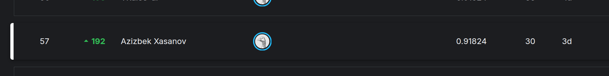

# Playground Series S6E3 — Predict Customer Churn

Azizbek Xasanov's solution for the Kaggle Playground Series competition [Predict Customer Churn (S6E3)](https://www.kaggle.com/competitions/playground-series-s6e3).

The task is binary classification of the `Churn` column (`Yes` / `No`). Training code scores predictions with ROC AUC (`sklearn.metrics.roc_auc_score`). The Playground table is a large synthetic set in the schema of the original Telco Customer Churn table. Both files are in this repo:

| File | Rows (excluding the header) | Role |
| --- | ---: | --- |
| `data/train.csv` | 594,194 | Playground train. Line count is 594,195. The same row count is `rows_used` in `outputs/fttransformer/submission/summary_fttransformer_submission.csv`, and it is the sum of each fold's `train_size` and `valid_size` in `dvae_outputs/dvae_metadata.json` (475,355 + 118,839, and 475,356 + 118,838 on the last fold). |
| `data/test.csv` | 254,655 | Playground test. Line count is 254,656. |
| `data/orig-Telco-Customer-Churn.csv` | 7,043 | Original Telco table (`customerID` instead of `id`). Line count is 7,044. Scripts also look for the Kaggle copies published under `azizbekxasanov/telco-customer-churn` and `blastchar/telco-customer-churn`. |

Train and test columns, from the headers of `data/train.csv` and `data/test.csv`:

`id`, `gender`, `SeniorCitizen`, `Partner`, `Dependents`, `tenure`, `PhoneService`, `MultipleLines`, `InternetService`, `OnlineSecurity`, `OnlineBackup`, `DeviceProtection`, `TechSupport`, `StreamingTV`, `StreamingMovies`, `Contract`, `PaperlessBilling`, `PaymentMethod`, `MonthlyCharges`, `TotalCharges`, and `Churn` on train only.




## Placement

The checked-in screenshots are the only leaderboard record in the repo.

| What is on the screenshot | Value | Source |
| --- | --- | --- |
| Rank and field size | 57 / 4142 | `images/competition-card.png` |
| Leaderboard score | 0.91824 | `images/leaderboard-rank.png` |
| Submissions shown on that row | 30 | `images/leaderboard-rank.png` |
| Rank movement shown on that row | 192 | `images/leaderboard-rank.png` |

57 / 4142 is about the top 1.4%. The screenshots show one score. They do not label it public or private, and they do not name the submission file that produced it.

A field size of 4143 is not in the repo. See [TODOs](#todos).

## Approach

There is no notebook in this repository. `notebooks/` is only a placeholder. Everything below is read from `src/` and from the score files that were kept under `outputs/` and `dvae_outputs*/`.

### EDA

No EDA notebook, plot, or printed finding is stored. Column names and row counts above are the data description that is actually in the tree. Conclusions such as churn rate, which contract or internet level separates churners, or which features a model ranked first are **TODO**.

The training scripts do encode a few domain combinations, which is not the same thing as a measured EDA result:

- `src/models/churn_training_only.py` collapses `"No internet service"` / `"No phone service"` to `"No"`, builds `contract_x_internet`, a month-to-month × fiber flag, a count of protection add-ons that are `"No"`, autopay, tenure bins, `TotalCharges / tenure`, and `TotalCharges - tenure * MonthlyCharges`. It also attaches a 5-neighbor churn rate from the original table on `tenure`, `MonthlyCharges`, and `TotalCharges`.
- `src/models/tabm_telco_solution.py` builds service-count buckets and target-encodes interactions such as `Contract × InternetService × PaymentMethod`.
- `src/models/gnn_5_variants_training.py` treats the same three numeric columns as graph coordinates.

### Feature engineering

Most `src/models/train_*_feature_ensemble.py` scripts share the same feature families, fit inside each CV fold:

| Family | What the code adds |
| --- | --- |
| `base` | The raw numeric and categorical columns. Tree models keep categoricals as categories. Logistic regression median-imputes, scales numerics, and one-hot encodes categoricals. |
| `binning` | Quantile bins (`qcut_bins = 8`), equal-width bins (`cut_bins = 8`), and floor-division bins with divisors 5 and 10. |
| `digit_features` | Sign, units, tens, hundreds, and two decimal digits for up to 8 numeric columns. |
| `frequency_encoding` | In-fold frequency of each value. Numerics are rounded to 3 decimals first. |
| `external_stats` | Mean, smoothed mean, weight of evidence, entropy, and count joined from the original Telco table plus the training fold. Smoothing is 30 and the minimum count is 10. |
| `all_as_categorical` | Every column treated as categorical. |
| `gp_features` | Symbolic features from `gplearn` where that script includes them (TabICL, RGF, AutoGluon). |

`src/models/dvae_tabular_pipeline.py` trains a denoising variational autoencoder and exports latent, residual, and reconstruction features, then fits XGBoost on raw features, on those views, and on concatenations of the two. A service-column view and a multi-view concatenation are included. The non-Optuna run in `dvae_outputs/dvae_metadata.json` used latent size 16 and an XGBoost head. The Optuna run in `dvae_outputs_optuna/metadata.json` selected latent size 40 and hidden sizes 256 × 128.

### Models

| Script | Model |
| --- | --- |
| `src/models/train_logistic_regression_feature_ensemble.py` | L2 logistic regression. Saved scores exist. |
| `src/models/train_xgboost_feature_ensemble.py` | XGBoost, `hist`, 1400 trees, early stopping 100. |
| `src/models/train_lightgbm_feature_ensemble.py` | LightGBM. |
| `src/models/train_catboost_feature_ensemble.py` | CatBoost, logloss / AUC. |
| `src/models/train_random_forest_feature_ensemble.py` | Random forest. |
| `src/models/train_rgf_feature_ensemble.py` | Regularized greedy forest (`RGF`, `RGF_Sib`, `RGF_Opt`). |
| `src/models/train_autogluon_feature_ensemble.py` | AutoGluon presets aimed at GBM+CatBoost, CatBoost only, neural nets, or a mix. |
| `src/models/train_tabicl_feature_ensemble.py` | TabICL. |
| `src/models/train_fttransformer_feature_ensemble.py` | FT-Transformer (`torch_frame`), 3 layers, 32 channels. Saved scores exist for `base_mixed` only. |
| `src/models/train_excelformer_feature_ensemble.py` | ExcelFormer. |
| `src/models/train_tabular_rnn_feature_ensemble.py` | TabulaRNN (`mambular` or `deeptab`). |
| `src/models/diverse_tabular_nn_5models.py` | Embedding MLP, tabular ResNet, FT-Transformer, DCNv2, and a mixture-of-experts MLP. 5-fold, seed 42. |
| `src/models/tabm_telco_solution.py` | TabM (`k = 16`) on five feature variants, then an exhaustive Ridge blend. |
| `src/models/gnn_5_variants_training.py` | Five GraphSAGE variants: kNN on one-hot features, frequency/cosine edges, quantile bins with cross features, a hybrid graph, and a random-forest proximity graph. |
| `src/models/dvae_tabular_pipeline.py` | DVAE features plus XGBoost, then a Ridge stack. Saved scores exist. |
| `src/models/churn_training_only.py` | Optuna-tuned XGBoost and LightGBM (15 trials), a `StackingClassifier` with logistic regression, and a rank average. |
| `src/models/deep_tabular_feature_variants.py`, `src/models/deep_tabular_torch_frame_utils.py` | Shared feature and `torch_frame` helpers. The FT-Transformer and ExcelFormer scripts inline their own copies. |

Scripts other than logistic regression, FT-Transformer, and the two DVAE output folders have **no saved CV file** in this tree.

### Cross-validation

The usual splitter is `StratifiedKFold(n_splits=5, shuffle=True, random_state=42)`.

- FT-Transformer and ExcelFormer have two modes. `experiment` uses 3 folds and `experiment_fraction` (the current default is `0.1`). `submission` uses 5 folds on all rows. The saved FT-Transformer experiment file records `rows_used = 29709`, while the submission file records `594194`. `int(594194 * 0.05) = 29709`, so that saved experiment matches a 5% slice. The fraction is not written into the JSON. The current default of `0.1` would be a different row count.
- `dvae_tabular_pipeline.py` searches with 3 stratified folds on a 40% subsample (`SEARCH_SUBSAMPLE_FRAC = 0.40`), 40 raw-XGBoost trials, 50 DVAE trials, and 15 stack trials (`SEARCH_BUDGET = "balanced"`). The refit uses 5 folds and DVAE seeds 42 and 123. The stacker's own fold splitter is seeded with `42 + 999`.
- `src/ensemble/ridge.py` searches model subsets with Optuna. `DEFAULT_N_OPTUNA_TRIALS` is 500, at least 5 models must be kept, and Ridge `alpha` is log-uniform from 0.01 to 100.

Test predictions are the mean of the fold models.

### Ensembling

The final-stage scripts stack out-of-fold prediction files. Those `.npy` files are not in the tree, so none of these blenders has a saved AUC here.

| Script | Method | Where a submission is written now |
| --- | --- | --- |
| `src/ensemble/blend.py` | Nonnegative weights, sum to 1, COBYLA, on a fixed dictionary of OOF files under `S6E3/`. Several MLP and XGBoost files are listed twice under different keys. | `outputs/submissions/submission.csv` |
| `src/ensemble/hblend.py` | Per-row rank blend. Descending-rank weight 0.70, ascending-rank weight 0.30. A second weight set is used when the row's prediction spread is at most 0.005, and a third when the spread is in (0.054, 0.074]. | `outputs/submissions/submission_hblend.csv` |
| `src/ensemble/ridge.py` | Optuna chooses a subset and a Ridge `alpha`. Features are standardized. The historical file name was `submission_ridge.csv`. | `outputs/submissions/submission_ridge.csv` |
| `src/ensemble/ridge_ensemble_all.py` | Ridge on every discovered model. `alpha` is chosen on an 80-point grid from 0.01 to 100. Also scans `other_ML/`. | `outputs/submissions/submission_ridge_all.csv` |
| `src/ensemble/logistic_ensemble_all.py` | L2 logistic regression on every discovered model. `C` is chosen on the same style of grid (80 points unless `LOGREG_GRID_POINTS` is set). | `outputs/submissions/submission_logreg_all.csv` |

`ridge.py`, `ridge_ensemble_all.py`, and `logistic_ensemble_all.py` look for `oof_*.npy` with a matching `test_*.npy` or `pred_*.npy` in `S6E3/`, `dvae_outputs/`, `dvae_outputs_optuna/`, `outputs/nn/`, and `outputs/gnn/`.

Inside `dvae_tabular_pipeline.py`, a Ridge stack is fit on the selected OOF columns. The saved search picked `alpha = 4.5705630998014515` and variants `raw_xgb`, `raw_plus_latent_ms`, `multiview_full_seed42`, `raw_plus_full_seed123`, and `raw_plus_full_seed42` (`dvae_outputs_optuna/metadata.json`).

`tabm_telco_solution.py` Ridge-blends subsets of its five TabM variants (`ridge_alpha = 1.0`). `churn_training_only.py` stacks XGBoost and LightGBM with logistic regression and also writes a rank average.

Ridge, logistic, and the DVAE stacker fit the meta-model on the same OOF rows they score. That number is the training-set AUC of the meta-model, not a nested out-of-fold AUC.

`data/train.csv` stores `Churn` as `Yes` and `No`. `blend.py` and `hblend.py` now map those labels to 0 and 1 before ROC AUC, using the same mapping `ridge.py` already applied.

## Scores

Displayed AUCs are the stored values rounded to 6 decimals. The exact floats are in the cited files. No leaderboard score below was inferred.

### Leaderboard versus stored CV

| Score | Value | What it is | Source |
| --- | ---: | --- | --- |
| Leaderboard | 0.91824 | Single unlabeled score on the rank-57 row | `images/leaderboard-rank.png` |
| Best stored OOF in the tree | 0.916238 | DVAE-pipeline Ridge stack, key `stack` | `dvae_outputs_optuna/metadata.json` `final_scores` |
| Best stored single model | 0.916222 | `raw_xgb` in that same file | `dvae_outputs_optuna/metadata.json` `final_scores` |

Public and private leaderboard scores are not stored separately. Which blend produced 0.91824 is not stored. See [TODOs](#todos).

### Logistic regression feature sweep

5-fold OOF AUC from `outputs/logistic_regression/summary_logreg.csv`. Fold AUCs are in the matching `*_fold_scores.json` files.

| Variant | Features | CV AUC | Features after encoding | Fit seconds |
| --- | --- | ---: | ---: | ---: |
| `base_plus_binning` | base + binning | 0.915474 | 2574 | 162.193 |
| `full_feature_stack` | base + binning + digits + frequency + external stats | 0.911966 | 2712 | 6821.525 |
| `base_plus_freq` | base + frequency | 0.909899 | 64 | 225.857 |
| `base_plus_digits` | base + digit features | 0.909288 | 69 | 268.519 |
| `base_numeric` | base | 0.907942 | 45 | 101.534 |

`base_plus_binning` fold AUCs (`outputs/logistic_regression/base_plus_binning_fold_scores.json`): 0.915521, 0.916101, 0.915567, 0.916541, 0.913665.

### FT-Transformer

Only `base_mixed` was written out. Summaries: `outputs/fttransformer/submission/summary_fttransformer_submission.csv` and `outputs/fttransformer/experiment/summary_fttransformer_experiment.csv`.

| Run | Rows | Folds | CV AUC | Features |
| --- | ---: | ---: | ---: | ---: |
| `submission` | 594194 | 5 | 0.911818 | 19 (`base`) |
| `experiment` | 29709 | 3 | 0.903824 | 19 (`base`) |

Submission fold AUCs (`outputs/fttransformer/submission/base_mixed_submission_fold_scores.json`): 0.911195, 0.912721, 0.912015, 0.913420, 0.910212.

Experiment fold AUCs (`outputs/fttransformer/experiment/base_mixed_experiment_fold_scores.json`): 0.902069, 0.905777, 0.911869.

### DVAE + XGBoost

Non-Optuna 5-fold XGBoost on DVAE features, from `dvae_outputs/dvae_metadata.json` `final_cv_scores`:

| Variant | CV AUC |
| --- | ---: |
| `full` | 0.909901 |
| `latent_resid` | 0.909693 |
| `latent` | 0.908578 |

OOF correlations among those three variants are 0.993677 to 0.997236 (`oof_prediction_correlations` in the same file). Every fold records `best_dvae_epoch = 1`, and the saved history tail shows validation loss rising after that epoch.

Optuna refit, from `dvae_outputs_optuna/metadata.json` `final_scores`. Search-time bests in the same file: raw XGBoost 0.916140 (`search_summary.raw_best`) and DVAE hybrid 0.915116 (`search_summary.dvae_best`). The stack search score is 0.916236 (`stack_search.score`); `final_scores.stack` is 0.916238.

| Variant | CV AUC |
| --- | ---: |
| `stack` | 0.916238 |
| `raw_xgb` | 0.916222 |
| `raw_plus_latent_ms` | 0.915714 |
| `raw_plus_latent_resid_ms` | 0.915657 |
| `multiview_full_ms` | 0.915519 |
| `raw_plus_full_ms` | 0.915424 |
| `full_ms` | 0.912741 |
| `latent_resid_ms` | 0.912511 |
| `latent_ms` | 0.912200 |
| `service_full_ms` | 0.911691 |

`ms` is the mean of seeds 42 and 123. The per-seed values are in the same `final_scores` object. Seed-123 and seed-42 copies sit within about 0.001 of the matching `ms` entry.

## What the stored numbers support

- Quantile and width binning was the logistic-regression result that moved CV the most: 0.915474 versus 0.907942 for the unbinned base, with fold AUCs in `base_plus_binning_fold_scores.json` all above 0.913.
- Frequency encoding and digit features improved logistic regression over the base (0.909899 and 0.909288 versus 0.907942) by less than binning did.
- Stacking every feature family into logistic regression scored 0.911966, below binning alone, and the summary file records 6821.525 fit seconds against 162.193 for binning.
- On the Optuna DVAE pipeline, raw XGBoost (0.916222) beat every DVAE-only view and every raw-plus-DVAE view. The Ridge stack's stored gain over raw XGBoost is 0.916238 − 0.916222.
- The three non-Optuna DVAE views are highly correlated (0.993677 to 0.997236), and the autoencoder's best epoch on every fold is epoch 1.
- FT-Transformer on all 594,194 rows scored 0.911818. The 29,709-row experiment scored 0.903824. Both are below the logistic binning model and below raw XGBoost in the Optuna file.
- The leaderboard value 0.91824 sits above every OOF AUC stored in this repo. The submission that scored it, and the public/private split, are not in the repo.

CatBoost, LightGBM, the XGBoost feature-ensemble script, random forest, RGF, AutoGluon, TabICL, ExcelFormer, TabulaRNN, TabM, the five GNNs, the five tabular nets, the COBYLA blend, and the rank blend have code and no saved score.

## Reproduce

From the repository root. `src/paths.py` points scripts at `data/` when the hardcoded Kaggle path is absent, and it writes Kaggle `/kaggle/working/...` outputs under `outputs/`.

```bash
python -m venv .venv
source .venv/bin/activate
pip install pandas numpy scikit-learn scipy
```

Extra libraries, only for the scripts that import them: `xgboost`, `lightgbm`, `catboost`, `optuna`, `torch`, `torch-frame`, `torch-geometric`, `tabicl`, `rgf-python`, `gplearn`, `autogluon.tabular`. Versions are not pinned in the repo.

Runs that match saved score files:

```bash
python src/models/train_logistic_regression_feature_ensemble.py
python src/models/train_fttransformer_feature_ensemble.py
python src/models/dvae_tabular_pipeline.py
```

`dvae_tabular_pipeline.py` defaults to `RUN_MODE = "train_best"` and will reuse `dvae_outputs_optuna/best_search_params.json` when that file is present. FT-Transformer defaults to `run_mode = "submission"`.

A short subset search:

```bash
N_OPTUNA_TRIALS=5 python src/ensemble/ridge.py
```

That command needs `oof_*.npy` / `test_*.npy` pairs in the directories listed above. Those arrays are not committed. The three historical submission CSVs (`submission_ridge.csv`, `submission_ridge_all.csv`, `submission_logreg_all.csv`) were removed from the current tree. They remain in git history. New submissions go to `outputs/submissions/`, which is gitignored.

## Layout

```text
data/                 train, test, and the original Telco CSV
src/models/           one script per model family
src/ensemble/         COBYLA blend, rank blend, Ridge, logistic meta-models
src/paths.py          local data and output paths
outputs/              CV summaries that were kept (logistic regression, FT-Transformer)
dvae_outputs/         non-Optuna DVAE metadata
dvae_outputs_optuna/  Optuna parameters and final scores
images/               leaderboard screenshots
notebooks/            empty; this solution was committed as scripts
```

`outputs/logistic_regression/all_oof_logreg.csv`, `outputs/logistic_regression/all_test_logreg.csv`, and the FT-Transformer OOF/test parquet files were removed from the current tree together with the submission CSVs. The score JSON and summary CSV files were kept. `.gitignore` ignores `submission*.csv`, `outputs/submissions/`, and `all_oof_*` / `all_test_*` prediction tables. History was not rewritten.

## TODOs

- Confirm whether the final leaderboard field is 4142, as in `images/competition-card.png`, or 4143.
- Record the public LB and the private LB separately. The screenshots show only 0.91824.
- Record which file was submitted for that 0.91824 row. The removed CSVs do not contain an AUC.
- Add the OOF `.npy` files, or a manifest of which models entered the winning blend. Without them, `src/ensemble/` cannot be re-run to the submitted prediction.
- Save CV summaries for the model scripts that currently have none.
- Write the EDA findings (churn rate, segment rates, and any feature-importance or error analysis). None are in the repo.
- Note the FT-Transformer experiment fraction next to `rows_used = 29709`. The current default `experiment_fraction` is 0.1. Applied to 594,194 rows, that default is 59,419 rows. `int(594194 * 0.05) = 29709`.
